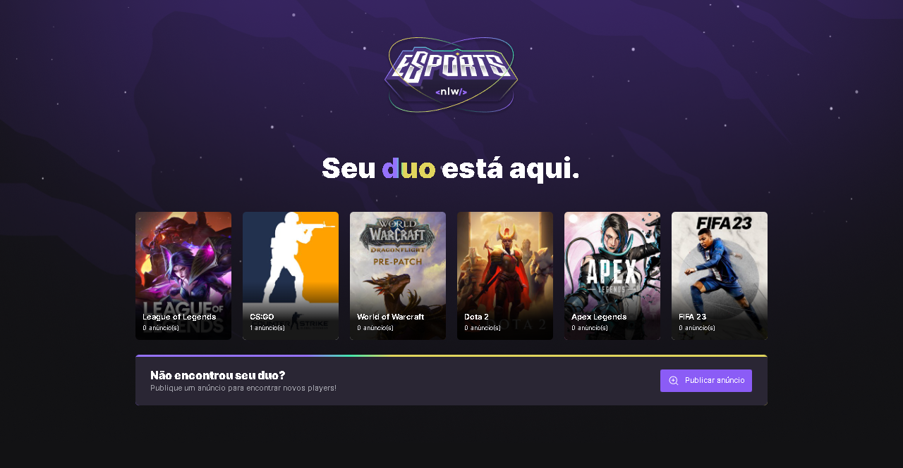

- Application to find duo to play games.
- This is a project developed during Next Level Week, offered by **[Rocketseat](https://www.rocketseat.com.br)**.

## ✨ Built with

- [React](https://reactjs.org/)
- [Tailwindcss](https://tailwindcss.com/)
- [Typescript](https://www.typescriptlang.org/)
- [Axios](https://axios-http.com/docs/intro)
- [NodeJs](https://nodejs.org/en/)
- [Express](https://expressjs.com)
- [Prisma](https://www.prisma.io/)
- [SQLite](https://www.sqlite.org/index.html)

## 🎉 Deploy

- Deploy Web (Vercel): https://nlw-e-sports-3otu.vercel.app/

## 🛠️ Features

- Register ads to find duos to play games

## 🔖 Layout

- You can view the layout of the project through **[this link](<https://www.figma.com/file/BKxvoDHeqer9yP5yQJV0Zv/NLW-eSports-(Community)?node-id=6%3A23&t=Sr2xJxtkDlhF7bC7-0>)**. You need an account on **[Figma](http://figma.com/)** to access it.

## 🚀 How to run

```bash
# Clone Repository
$ git clone https://github.com/daniel-nicacio/nlw-eSports.git
```

### web

```bash
# Insert in terminal
$ cd web
# Install Dependencies
$ npm i
# Run Application
$ npm run dev
```

### server

```bash
# Insert in terminal
$ cd server
# Install Dependencies
$ npm i
# Make a copy of '.env.example' to '.env'
# and set with YOUR environment variables.
# run the migrations
$ npx prisma migrate dev
# Run Application
$ npm run dev
```

## 👨‍💻 Built by

- LinkedIn: https://www.linkedin.com/in/daniel-nic%C3%A1cio-figueiredo/
- E-mail: danielfigueiredo789@gmail.com

## 📄 License

This project is under the MIT license. See the [LICENSE](LICENSE) file for more details.
